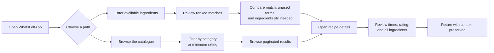
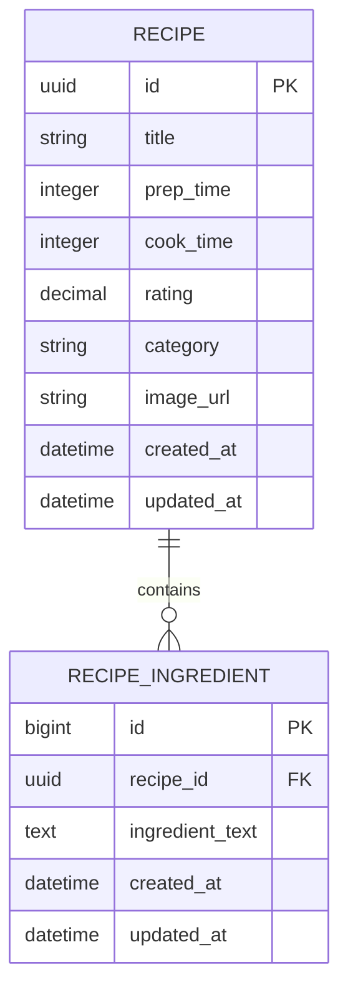

# WhatsLeftApp

WhatsLeftApp helps people find recipes they can make with ingredients they
already have. It is a server-rendered Rails application with two paths:

- **Match recipes** from a list of available ingredients.
- **Browse recipes** by category or minimum rating.

**Live app:** [https://whatsleftapp.fly.dev/](https://whatsleftapp.fly.dev/)

The Fly.io Machine stops when idle, so the first request after a quiet period
may take a few seconds.

## Contents

- [What the app does](#what-the-app-does)
- [User stories](#user-stories)
- [User journey](#user-journey)
- [How search works](#how-search-works)
- [Architecture](#architecture)
- [Data model](#data-model)
- [Dataset import](#dataset-import)
- [Frontend and UX](#frontend-and-ux)
- [Running locally](#running-locally)
- [Tests and quality checks](#tests-and-quality-checks)
- [Performance and security](#performance-and-security)
- [Deployment](#deployment)
- [Decisions and tradeoffs](#decisions-and-tradeoffs)
- [Limitations and possible improvements](#limitations-and-possible-improvements)
- [AI assistance](#ai-assistance)
- [Original assignment brief](#original-assignment-brief)

## What the app does

The bundled dataset contains 10,013 recipes. After import, the database holds
96,080 ingredient rows.

Users can:

- enter ingredients individually or paste comma- or line-separated lists;
- see ranked recipe matches and the total number of results;
- see which search terms matched, which were unused, and which recipe
  ingredients they may still need;
- open a recipe without losing their search or browse context;
- browse the catalogue by exact category and minimum rating;
- move through stable, paginated results.

The application is read-only. Accounts, saved recipes, shopping lists,
nutrition, substitutions, and quantity-aware pantry management are outside the
scope of this prototype.

## User stories

1. **As a home cook**, I want to enter ingredients I have at home so that I can
   see the most relevant recipes I could prepare.
2. **As a home cook reviewing a match**, I want to know why it matched and what
   else I may need so that I can decide whether the recipe is practical.
3. **As a visitor looking for inspiration**, I want to browse and filter the
   catalogue without first entering ingredients.

## User journey



## How search works

The source data stores ingredients as free-text lines:

```text
2 cloves garlic
1 (14 ounce) can crushed tomatoes
4 skinless, boneless chicken breast halves
```

Fully parsing those lines into quantities, units, products, and canonical
ingredients would be a separate data project. For this version, I kept the
original text and treated matching as a PostgreSQL text-search problem.

### Input handling

`IngredientNormalizer` trims and lowercases each term, removes blanks and
duplicates, and preserves input order. It also applies these bounds:

- 3–100 characters per ingredient;
- no more than 25 distinct ingredients;
- page numbers between 1 and 1,000;
- 12 results per page.

The browser exposes the same ingredient limits, but the server applies them
again and remains authoritative.

### Matching

Ingredient rows are matched with case-insensitive substring search:

```sql
ingredient_text ILIKE '%' || search_term || '%'
```

`pg_trgm` and a GIN trigram index make the leading-wildcard lookup practical.
The application is not using trigram similarity as a relevance score: matching
still follows ordinary substring rules.

Search terms are escaped with `sanitize_sql_like` and quoted through the
database connection before they enter the query.

### Eligibility

Returning every recipe containing one searched ingredient creates too many
incidental matches. Requiring 50% recipe coverage was too strict and removed
useful recipes with several supporting ingredients.

The current rule is:

```text
at least one matched search term
AND at least one matched ingredient row
AND (
  a matched term also appears in the title
  OR at least two ingredient rows match
  OR recipe ingredient coverage is at least 25%
)
```

For example:

| Match | Eligible? | Reason |
|---|---:|---|
| `garlic` matches one of six lines and appears in the title | Yes | Title signal |
| `garlic` matches two of twenty lines | Yes | Two matching rows |
| `tomato` matches one of four lines | Yes | 25% coverage |
| `salt` matches one of thirty lines and not the title | No | Incidental single match |

The title is only a supporting signal. A term in the title must also match at
least one ingredient row.

The rule is monotonic: adding an unrelated pantry ingredient cannot reduce a
recipe's matched terms, matched rows, title match, or coverage. A valid result
does not disappear just because the user supplied an extra ingredient.

### Ranking

Eligible recipes are ordered by:

1. Number of distinct search terms matched.
2. Whether a matched term appears in the title.
3. Recipe ingredient coverage.
4. Number of matching ingredient rows.
5. Number of recipe ingredient rows still unmatched.
6. Known preparation/cooking time before completely unknown time.
7. Shorter combined preparation and cooking time.
8. Rating, with unrated recipes last.
9. Title.
10. UUID.

This is a lexicographic order rather than a weighted score. The rules are easy
to inspect, explain, and test, and the final title/UUID tie-breakers keep
pagination stable.

### Result metadata

The result cards distinguish between:

| Label | Meaning |
|---|---|
| Ingredient match | Percentage of the recipe's ingredient rows covered by the search |
| Matched search ingredients | Terms supplied by the user that occur in the recipe |
| Unused search ingredients | Supplied terms that do not occur in that recipe |
| You may still need | Recipe ingredient rows not covered by any supplied term |

Cards initially show three ingredients under **You may still need**. A native
show/hide disclosure keeps the rest available without making every card
unnecessarily tall. The recipe page shows the same match context and the full
ingredient list.

### SQL query

`RecipeMatcherQuery` keeps the PostgreSQL-specific query in one place:

| CTE | Purpose |
|---|---|
| `search_terms` | Turns normalized Ruby values into a SQL relation |
| `ingredient_matches` | Finds rows and counts distinct terms/ingredient rows per recipe |
| `recipe_matches` | Adds the title-match signal |
| `ingredient_counts` | Counts all ingredient rows for candidate recipes |
| Final `SELECT` | Applies eligibility, calculates metadata, orders, counts, and paginates |

`COUNT(DISTINCT ...)` prevents one ingredient line that matches several search
terms from inflating the matched-row count. `COUNT(*) OVER()` returns the total
number of eligible recipes with the result page.

Substring matching has known weaknesses. For example, `egg` can match
`eggplant`, and `oil` can occur inside a longer word. It also does not
understand synonyms, quantities, substitutions, or ingredient importance. I
accepted that limitation instead of adding an unproven ingredient parser to the
take-home.

## Architecture

The application follows conventional Rails request handling, with small Ruby
objects for the parts that contain real search or import logic.

### Routes

| Path | Action | Purpose |
|---|---|---|
| `GET /` | `PagesController#home` | Choose search or browse |
| `GET /search` | `RecipesController#index` | Search and render ranked matches |
| `GET /recipes` | `RecipesController#browse` | Browse and filter the catalogue |
| `GET /recipes/:id` | `RecipesController#show` | View one recipe |
| `GET /up` | Rails health controller | Deployment health check |

### Main components

| Component | Responsibility |
|---|---|
| `RecipesController` | Request parameters and response preparation |
| `IngredientNormalizer` | Search-input normalization and bounds |
| `RecipeMatcher` | Search orchestration, pagination, loading, and result construction |
| `RecipeMatcherQuery` | PostgreSQL matching, eligibility, and ranking |
| `RecipeBrowser` | Catalogue filtering, counting, and pagination |
| `Recipe` | Associations and browse scopes |
| `RecipeMatch` | Per-recipe match and missing-ingredient metadata |
| `RecipeSearchResult` | Recipes plus page and total-count metadata |
| `RecipeCard` | Shared interface for search and browse cards |
| `RecipeImporter` | Dataset validation, normalization, and bulk loading |
| `RecipeImageUrlResolver` | Converts a known proxy image format to its source URL |
| `RecipesHelper` | Form options and pagination presentation |

Search and browse share pagination and result metadata but not a generic query
framework. Search needs aggregate SQL; browse is clearer as ordinary
Active Record scopes.

Search, browse, and show load `recipe_ingredients` before rendering the
ingredient information used by their views, avoiding N+1 queries.

## Data model



Ingredient lines have their own table instead of living in a JSON column. This
makes each line indexable and lets the query aggregate recipe matches using the
database.

The content remains free text. A canonical `ingredients` table would only be
useful with reliable extraction, synonym handling, and rules for compound
products—work the dataset does not support on its own.

Recipes use UUID primary keys because those IDs appear in public detail URLs.
Ingredient rows use ordinary bigint IDs because they are internal import
records.

The dataset has no stable upstream recipe ID, so every full import generates
new recipe UUIDs. Detail URLs are therefore not stable across imports. A
production import process would need a durable source identifier before
promising stable links.

Database integrity includes:

- non-null recipe titles, ingredient text, and recipe foreign keys;
- a foreign key from ingredients to recipes;
- an index on `recipe_ingredients.recipe_id`;
- a GIN trigram index on `ingredient_text`;
- `pgcrypto` for UUID generation;
- `pg_trgm` for indexed substring search.

## Dataset import

The provided file is stored at `data/recipes.json` and imported with:

```sh
bin/rails recipes:import
```

Expected output:

```text
Recipes imported: 10013
Ingredients imported: 96080
Recipes skipped: 0
```

The importer:

1. validates the file and JSON root;
2. reports malformed records;
3. replaces existing recipe data inside a transaction;
4. generates recipe UUIDs;
5. inserts recipes and ingredients in batches of 1,000;
6. returns imported and skipped counts.

During import it:

- trims, lowercases, and de-duplicates ingredient lines within each recipe;
- removes blank ingredient values;
- decodes HTML entities in category names;
- stores blank categories as `NULL`;
- extracts source image URLs from the known Meredith proxy format.

The source fields retained are:

| Source field | Stored as |
|---|---|
| `title` | Required recipe title |
| `prep_time`, `cook_time`, `ratings` | Optional recipe metadata |
| `category` | Optional, canonical category |
| `image` | Resolved image URL |
| `ingredients` | Free-text `recipe_ingredients` rows |

`cuisine` is omitted because every value in the dataset is blank. `author` is
not needed for the ingredient-matching journey.

The import is a full replacement rather than an incremental sync because the
source has no reliable identifier. It reads the complete 5.9 MB document into
memory, which is reasonable at this size.

The import is separate from `db:seed` so database setup does not silently
perform a destructive catalogue replacement. A maintenance task is also
available for databases imported before image URL normalization:

```sh
bin/rails recipes:resolve_image_urls
```

Fresh imports do not need it.

## Frontend and UX

The UI uses ERB, Turbo, and two small Stimulus controllers. Import maps remove
the need for Node.js or a frontend build pipeline.

- `ingredient_chips_controller.js` handles chips, paste input, removal, and
  clearing while submitting a normal GET form.
- `image_fallback_controller.js` replaces unavailable external images with a
  text placeholder.
- Native `<details>` elements reveal longer missing-ingredient lists without
  JavaScript.
- Search terms and browse filters stay in the URL, so pagination and back
  navigation preserve context.

Accessibility work includes visible labels, keyboard-operable chip controls,
ingredient-specific remove labels, an `aria-live` chip list, labelled
pagination, current/disabled page states, focus-visible styles, semantic lists,
and text labels that do not rely on colour alone.

The layout was tested manually on desktop and mobile as well as through request
and browser specs.

## Running locally

### Requirements

| Dependency | Version |
|---|---|
| Ruby | 3.3.5 |
| Rails | 8.0.5 |
| PostgreSQL | 16 in CI; 17 in production |
| System-spec browser | Chrome or Chromium |

After cloning the repository:

```sh
bin/setup --skip-server
bin/rails recipes:import
bin/dev
```

Open [http://localhost:3000](http://localhost:3000).

`bin/setup` installs missing gems, prepares the development and test databases,
and clears old logs and temporary files. It expects a running PostgreSQL server
and a local role able to create `recipe_finder_development` and
`recipe_finder_test`.

Running `bin/setup` without `--skip-server` starts the development server after
database setup. The recipe import remains a separate required step.

Quick data check:

```sh
bin/rails runner 'puts [Recipe.count, RecipeIngredient.count]'
```

After import, it should print `[10013, 96080]`.

## Tests and quality checks

The suite contains **155 RSpec examples** covering:

- search normalization, eligibility, monotonicity, ranking, totals, and
  pagination;
- importer validation, normalization, rollback, and Rake task output;
- match metadata, presenter behaviour, and pagination helpers;
- request flows, filters, empty states, stable ordering, and preserved context;
- real-browser chip interaction and failed-image fallback.

Run it with:

```sh
bundle exec rspec
```

Useful focused commands:

```sh
bundle exec rspec spec/services/recipe_matcher_spec.rb
bundle exec rspec spec/requests/recipes_spec.rb
bundle exec rspec spec/system/recipe_frontend_spec.rb
```

Other checks:

```sh
bin/rubocop
bin/brakeman --no-pager
bin/rails zeitwerk:check
```

GitHub Actions runs RSpec against PostgreSQL 16, RuboCop, and Brakeman on pull
requests and pushes to `main`.

## Performance and security

The search path was tested with `EXPLAIN (ANALYZE, BUFFERS)`, which confirmed
use of the trigram index. As an indicative production measurement, five
consecutive `garlic` searches from the Fly.io application to Neon took:

```text
128.9 ms, 9.5 ms, 10.9 ms, 4.5 ms, 4.2 ms
```

The first result reflects cold caches. These timings are a snapshot rather than
an SLA, and a stopped Fly Machine adds startup time before Rails handles the
request.

At the current scale—about 10,000 recipes and 96,000 ingredient rows—I did not
add result caching, denormalized counts, keyset pagination, or background
precomputation.

The public application has no accounts, writes, uploads, or mass-assignment
endpoints. Its main untrusted input is the query string. Controls include:

- bounded ingredient, page, and page-size inputs;
- escaped SQL wildcards and connection-quoted search values;
- an allow-list for rating filters;
- Rails' default ERB escaping;
- HTTPS in production;
- Fly secrets for `DATABASE_URL` and `SECRET_KEY_BASE`;
- Brakeman in CI.

External recipe images are not proxied or stored. Unavailable images fall back
to local placeholder text.

## Deployment

The live application uses:

| Component | Configuration |
|---|---|
| Rails app | One Fly.io Machine in Frankfurt (`fra`) |
| Compute | Shared CPU and 512 MB memory |
| Database | Neon PostgreSQL 17 in Frankfurt |
| Health check | `GET /up` |
| Idle behaviour | Stop when idle and start on demand |
| Minimum Machines | 0 |

The multi-stage Docker build installs only production gems in the final image,
precompiles Bootsnap and Propshaft assets, and runs Rails as an unprivileged
user. Asset compilation uses dummy build-time values rather than production
secrets.

Fly runs this release command before routing traffic to a new version:

```sh
bin/rails db:prepare
```

The production `DATABASE_URL` uses Neon's direct endpoint so migrations do not
run through transaction pooling.

Initial deployment:

```sh
fly secrets set DATABASE_URL='postgresql://...' SECRET_KEY_BASE="$(bin/rails secret)"
fly deploy
fly ssh console -C "bin/rails recipes:import"
```

The recipe import is not part of the release command because it replaces all
catalogue data.

Useful checks:

```sh
fly status
fly checks list
fly logs
```

Scale-to-zero keeps the demo inexpensive. The tradeoff is first-request latency
and a single application Machine rather than high availability.

## Decisions and tradeoffs

| Decision | Reason | Tradeoff |
|---|---|---|
| Free-text ingredients | Avoid unreliable parsing of scraped lines | Substring false positives; no semantic model |
| Separate ingredient rows | Supports indexing and recipe-level aggregation | More import work than a JSON column |
| Explicit PostgreSQL query | Keeps aggregate search logic readable | Database-specific SQL |
| Hybrid eligibility rule | Filters incidental matches without requiring high coverage | Heuristic thresholds need usage data to tune |
| Ordered ranking instead of a weighted score | Easier to explain and test | Less nuanced than a learned ranking model |
| Full-replacement bulk import | Reliable for a static source without IDs | Reimports change recipe UUIDs |
| ERB with small Stimulus controllers | Rails-native and sufficient for the required interactions | Less client-side behaviour than a SPA |
| Shared pagination utility | Removes real duplication | Offset pagination is not aimed at very large datasets |
| External image URLs | Avoids an image-storage pipeline | Depends on upstream availability |
| Scale-to-zero Fly deployment | Keeps idle cost low | Cold starts |

## Limitations and possible improvements

Current limitations:

- substring matching can produce lexical false positives;
- ingredient quantities and importance are ignored;
- missing ingredients are unmatched text rows, not a true shopping-list model;
- the source contains no cooking instructions or stable recipe IDs;
- lowercasing during import loses original ingredient capitalization;
- recipe URLs change after a full reimport;
- upstream images can disappear;
- production uses one scale-to-zero Machine with no formal uptime target.

If the product were taken further, I would first measure search precision and
recall with labelled examples. That evidence would guide token-boundary rules,
aliases, or a canonical ingredient model. Other useful next steps would be a
stable source identifier and incremental import, richer source data with
instructions, and user-tested filters such as available cooking time.

Caching, keyset pagination, additional Machines, and broader observability would
make sense only when traffic or reliability requirements justify them.

## AI assistance

I used OpenAI Codex as a collaborative engineering assistant for:

- code review and edge-case analysis;
- comparing search eligibility rules;
- drafting and refining tests for agreed behaviour;
- accessibility and responsive-UI review;
- query-performance investigation;
- deployment preparation and smoke testing;
- preparing a clean submission history;
- drafting and fact-checking this README.

I reviewed suggestions before applying them and kept changes within the agreed
scope. I validated the result with 155 RSpec examples, focused tests during
development, RuboCop, Brakeman, Zeitwerk, query plans and timings, manual
desktop/mobile testing, and checks against the deployed application.

---

# Original assignment brief

# Problem statement

### _It's dinner time!_ Create an application that helps users find the most relevant recipes that they can prepare with the ingredients that they have at home

## Objective

Deliver a prototype web application to answer the above problem statement.

__✅ Must have's__

- A back-end with Ruby on Rails (If you don't know Ruby on Rails, refer to the FAQ)
- A PostgreSQL relational database
- A well-thought user experience

__🚫 Don'ts__

- Excessive effort in styling
- Features which don't directly answer the above statement
- Over-engineer your prototype

## Deliverable

- The codebase should be pushed on the current GitHub private repository.
- 2 or 3 user stories that address the statement in your repo's `README.md`.
- The application accessible online (a personal server, fly.io or something else). If you can't deploy your app online, refer to the FAQ)
- Submission of the above via [this form](https://forms.gle/siH7Rezuq2V1mUJGA).
- If you're on Mac, make sure your browser has [permission to share the screen](https://support.apple.com/en-al/guide/mac-help/mchld6aa7d23/mac).


## Data

Please start from the following dataset to perform the assignment:
[english-language recipes](https://pennylane-interviewing-assets-20220328.s3.eu-west-1.amazonaws.com/recipes-en.json.gz) scraped from www.allrecipes.com with [recipe-scrapers](https://github.com/hhursev/recipe-scrapers)

Download it with this command if the above link doesn't work:
```sh textWrap
wget https://pennylane-interviewing-assets-20220328.s3.eu-west-1.amazonaws.com/recipes-en.json.gz && gzip -dc recipes-en.json.gz > recipes-en.json
```

## FAQ

<details>
<summary><i>I'm a back-end developer or don't know React, what do I do?</i></summary>

Just make the simplest UI, style isn't important and server rendered HTML pages will do!
</details>

<details>
<summary><i>Can I have a time extension for the test?</i></summary>

No worries, we know that unforeseen events happen, simply reach out to the recruiter you've been
talking with to discuss this.
</details>

<details>
<summary><i>Can I transform the dataset before seeding it in the DB</i></summary>

Absolutely, feel free to post-process the dataset as needed to fit your needs.
</details>

<details>
<summary><i>Should I rather implement option X or option Y</i></summary>

That decision is up to you and part of the challenge. Please document your choice
to be able to explain your reflexion and choice to your interviewer for the
challenge debrief.
</details>

<details>
<summary><i>Do I really have to deploy the application online?</i></summary>
Deploying the application does ensure a smooth interview experience by allowing interviewers to test your code live. However, you should not overinvest time (or money) on this if you really can't figure it. You can alternatively provide demo videos as a worst case option, as interviewers won't checkout and run the application to cover for missing demo or online version. In case you don't have an online application, please make sure everything is working smoothly
locally before your debrief interview.
  
</details>

<details>
<summary><i>I don't know <b>Ruby on Rails</b></i></summary>

That probably means you're applying for a managerial position, so it's fine to
pick another language of your choice to perform this task.
</details>

<details>


<summary><i>Can I use AI tools?</b></i></summary>

You are free to use AI tools to assist you in completing this case study. To maintain transparency, please document which AI tools you used during the assignment.

For each tool, briefly explain:
- The main tasks or problems for which you used it.
- How you validated and refined any AI-generated code.

Note: While AI can be a valuable assistant, interviewers will assess your ability to understand the entire codebase, explain key technical choices, and effectively answer technical questions about improvements. We expect candidates to use AI as a supportive tool rather than having it generate the complete solution. AI should supplement your coding process, not replace your critical thinking and hands-on development work.
</details>
